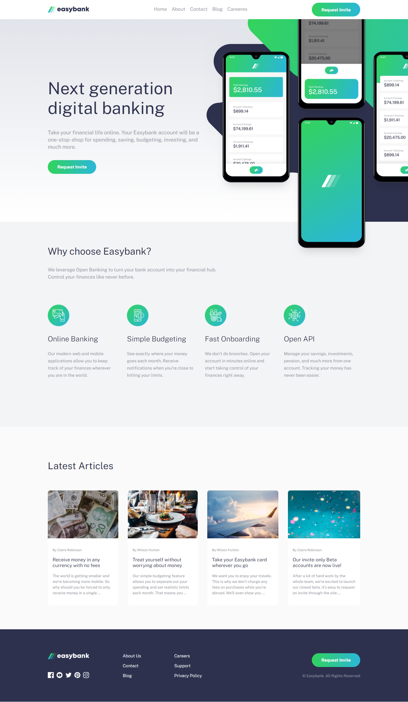
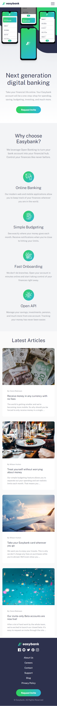

# Frontend Mentor - Easybank landing page solution

This is a solution to the [Easybank landing page challenge on Frontend Mentor](https://www.frontendmentor.io/challenges/easybank-landing-page-WaUhkoDN). Frontend Mentor challenges help you improve your coding skills by building realistic projects. 

## Table of contents

- [Overview](#overview)
  - [The challenge](#the-challenge)
  - [Screenshot](#screenshot)
  - [Links](#links)
- [My process](#my-process)
  - [Built with](#built-with)
  - [What I learned](#what-i-learned)
  - [Continued development](#continued-development)
  - [Useful resources](#useful-resources)
- [Author](#author)

## Overview
Challenge completed using HTML5,CSS and React js . The solution implement the desktop and mobile versions 

### The challenge

Users should be able to:

- View the optimal layout for the site depending on their device's screen size
- See hover states for all interactive elements on the page

### Screenshot

* Desktop version (width : 1440px)

* Mobile version (width : 375px)

### Links

- Solution URL: [Add solution URL here](https://www.frontendmentor.io/solutions/responsive-version-using-html5-css3-and-react-js-JB7WAVp_h)
- Live Site URL: [Add live site URL here](https://baraneeasybank.netlify.app/)

## My process

### Built with

- HTML5 
- CSS custom properties
- Flexbox
- CSS Grid
- Sass
- [React](https://reactjs.org/) - JS library

### Continued development

next js framework will be used in the future , so that the app server side rendered ,which will allow us to implement the seo concepts 

### Useful resources

- [stackoverflow](https://www.stackoverflow.com) - This helped me for bug fixing. 
- [flaticon](https://www.flaticon.com) - This website provide useful icon in svg and png format , I used it to download the menu and close icon.
- [css-tricks](https://www.css-tricks.com) - This website contains plenty of articles that let you understand more css concepts , I used it to know how to change the color of an svg image.

## Author

- Frontend Mentor - [@abdelghafourbarane](https://www.frontendmentor.io/profile/abdelghafourbarane)
- Linkedin - [@Abdelghafour Barane](https://www.linkedin.com/in/abdelghafour-barane-54a443148/)
- Gmail - [@barane abdelghafour](baraneabdelghafour@gmail.com)

